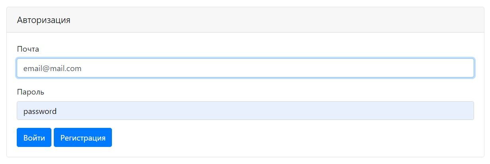
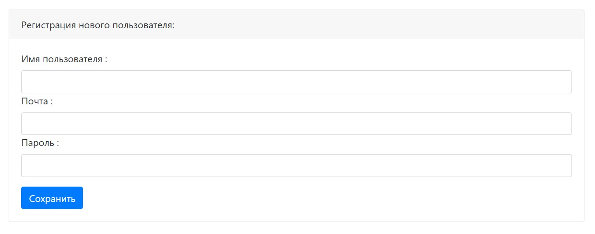
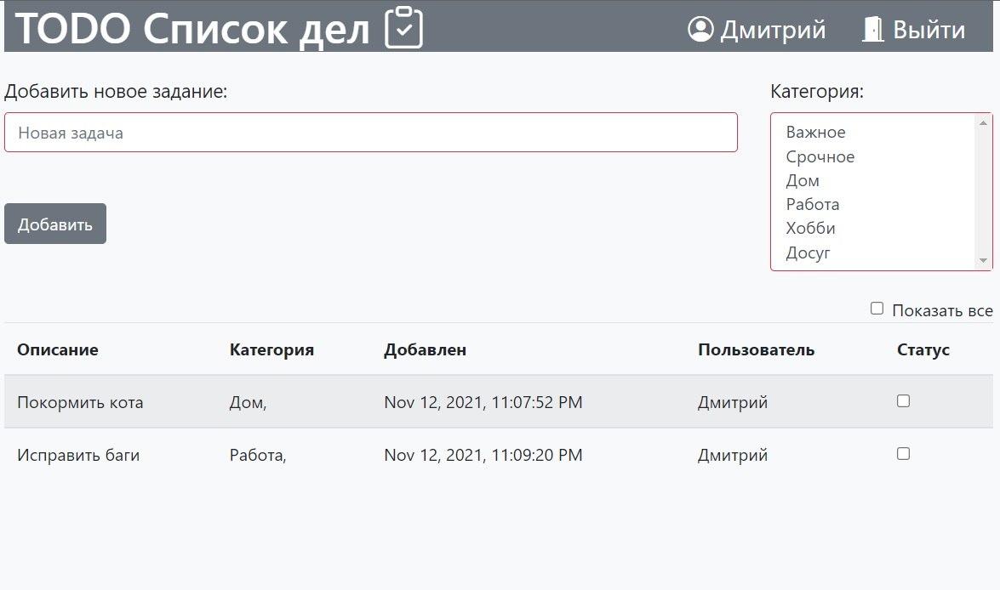
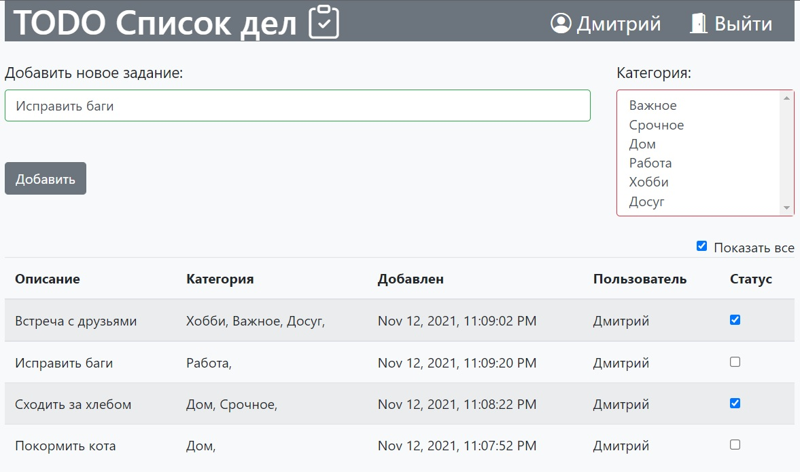

# job4j_TodoList

#### Программа для управления своим списком дел
- Регистрация пользователя
- Форма входа в программу
- Добавление актуальных дел в базу данных и отображение автора
- Возможность отметки как выполненное
- Вывод актуальных дел и возможность отображения всех дел
- Добавление одной или нескольких категорий для каждого задания

#### Используемые технологии  
- Hibernate (PostgreSQL)
- JAVA servlets/JSTL
- Bootstrap
- JS/jQuery/AJAX
- Slf4j
- Travis CI

#### Интерфейс
- Авторизация:

- Регистрация:

- Список актуальных дел:

-Список всех дел:
