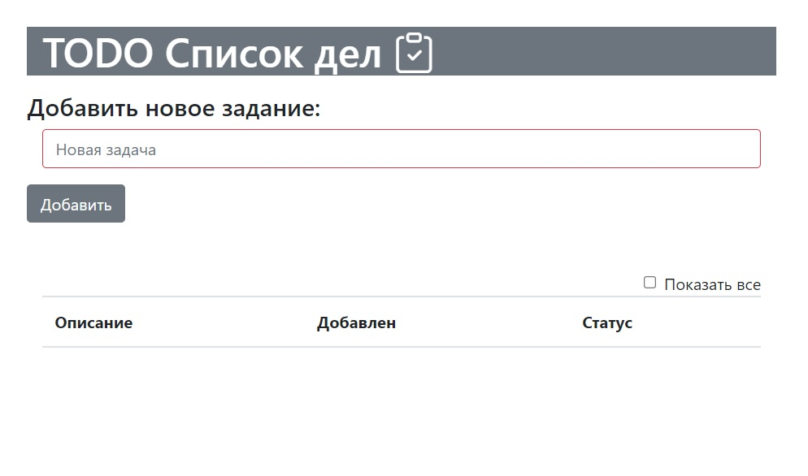
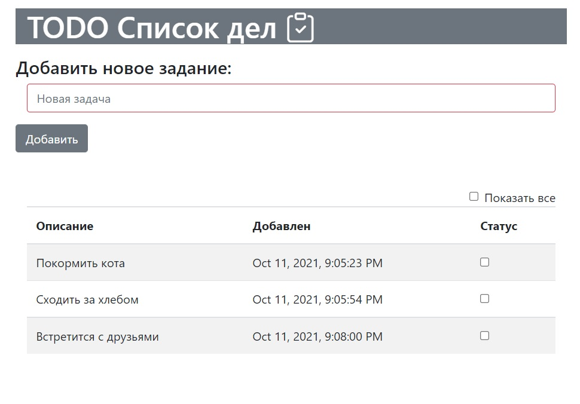
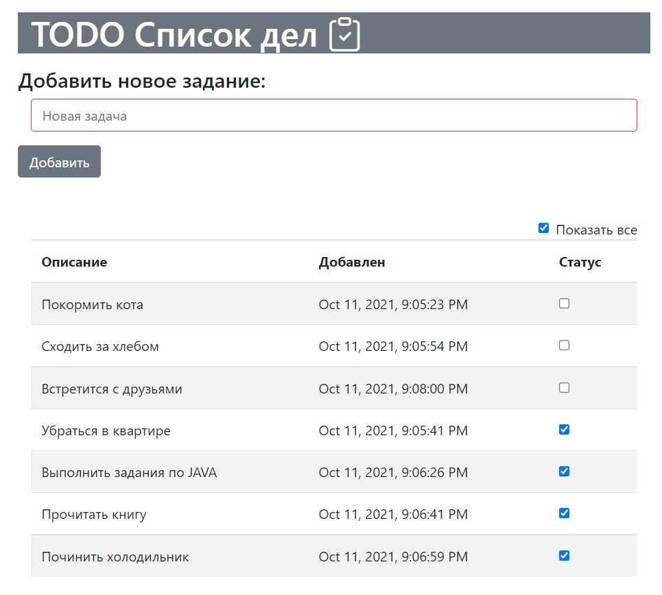

# job4j_TodoList

#### Программа для управления своим списком дел
- Добавление актуальных дел в базу данных
- Возможность отметки как выполненное
- Вывод актуальных дел и возможность отображения всех дел

#### Используемые технологии  
- Hibernate (PostgreSQL)
- JAVA servlets/JSTL
- Bootstrap
- JS/jQuery/AJAX
- Slf4j
- Travis CI

#### Интерфейс
- Главная страница, проверка поля ввода:

- Список актуальных дел:

- Список всех дел:
